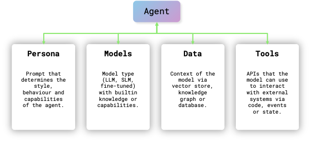
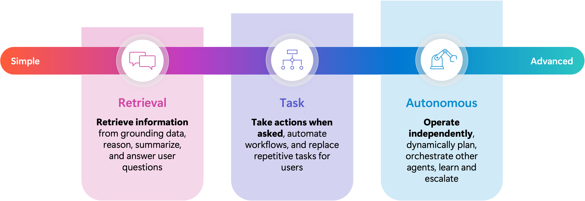

# Enterprise playground for agents

This project demonstrates agentic concepts, orchestration patterns and functional scenarios using azure foundry models and various open souce frameworks like Semantic Kernel, LangChain and Azure Agents in an enterprise context.

That gives you the chance to learn how to combine these capabilities by orchestrating them:
- Implementing a ReAct pattern with a single agent to plan and execute iterative tasks
- Using dynamic code generation and execution to generate new files
- Forcing the model to use and think in Domain Specific Languages to interact with existing code
- Combining different agent types to solve complex problems through defined interaction patterns
- Tasking a reasoning model to solve complex problems on its own without orchestration

Since there are multiple agentic frameworks and hosting runtimes these will let you see how different collaboration patterns can be implemented:
- Planned agent interactions can be implemented with any agent framework
- Graph based interactions between agents can be implemented with LangGraph
- Tasking agents using Foundry ConnectedAgents
- Dynamically discovering agents via Foundry MCP server to invoke tasks on them
- Persisting memory between different agent interactions via mem0

## What is an Agent?

> ***agent***: 	perceives its environment, makes decisions, takes actions autonomously in order to achieve goals, and may improve its performance with learning or acquiring knowledge 

A simple LLM-based chatbot primarily focuses on generating responses based on predefined patterns and language models, often requiring user input to continue the conversation. In contrast, autonomous agents are designed to perform tasks independently, making decisions and taking actions without constant user input, often leveraging advanced AI techniques to achieve their goals. 

## Preparation

[Deploy To Azure](https://portal.azure.com/#create/Microsoft.Template/uri/https%3A%2F%2Fraw.githubusercontent.com%2Fazure-ai-foundry%2Ffoundry-samples%2Frefs%2Fheads%2Fmain%2Fsamples%2Fmicrosoft%2Finfrastructure-setup%2F40-basic-agent-setup%2Fbasic-setup.json)

## Smoke test

0. Login into azure cli `azure login`

1. Retrieve "Azure AI Foundry project endpoint" from Foundry project overview 

2. Rename .env_template to .env and set foundry project env variable

3. Run `python ./src/00-hello-world/agent.py`

## Workshop contents

The scope of this workshop covers the following scenarios and technology stacks:

| Name | Description | Technology  |
| :-- | :--| :-- |
| [Hello World](./src/00-hello-world/README.md) | Hello World model | Azure Foundry Agent, Open Telemetry |
| [Single Agent](./src/01-react-agents/README.md) | ReAct Agent | Azure Foundry Agent, LangGraph |
| [Agent RAG](./src/02-agents-rag/README.md) | Agentic RAG and Code execution | Azure Foundry Agent |
| [MCP Servers](./src/03-mcp-servers/README.mdy) | Model Context Protocol Servers| LangChain, FASTMCP |
| [Connected Agents](./src/04-connected-agents/README.md) | Connected Agents | Foundry Agents |
| [Agents as Tools](./src/05-agents-as-tools/README.md) | Agents via MCP | Foundry Agents, MCP |
| [Reasoning Agents](./src/06-reasoning-agents/README.md) | Multi agents vs Reasoning Agents | Foundry Agents, Semantic Kernel |
| [Agent Memory](./src/07-agent-memory/README.md) | Multiple agents sharing memory | Foundry Agents, Semantic Kernel, Mem0 |