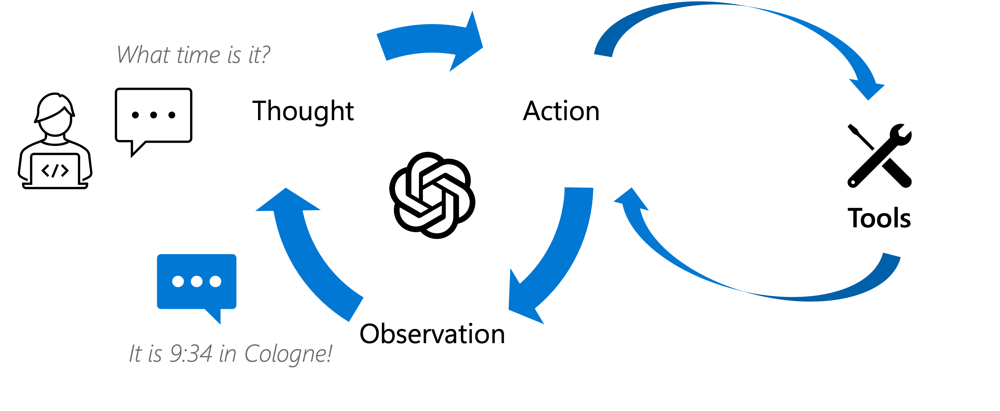

# React Agent

The objective of this lab is to learn how to implement a ReAct agent.




## Steps

1. Start the react agent

```
python simple-react.py
```

2. Ask the model about time

3. Add the tools for [get_current_time] and ask again

4. Add all the tools for [get_current_username, get_current_location, get_current_time] and ask again

5. Look at the traces