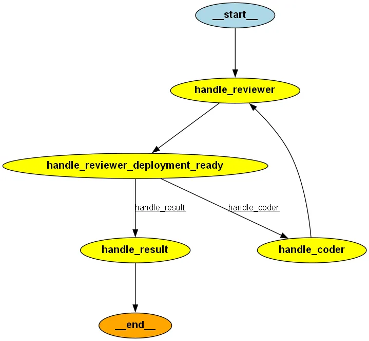

# Multi agent collaboration

What is required to implement interactions between multiple agents

## Execute coding agents



Start the coding agents

```
python coding-agents.py
```


## Launch reasoning model

```
python reasoning-coder.py
```